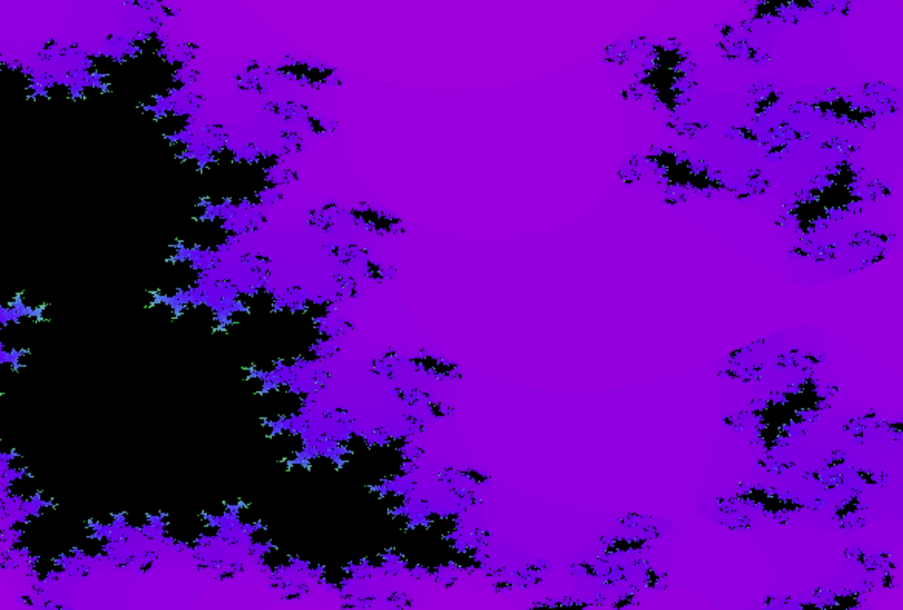
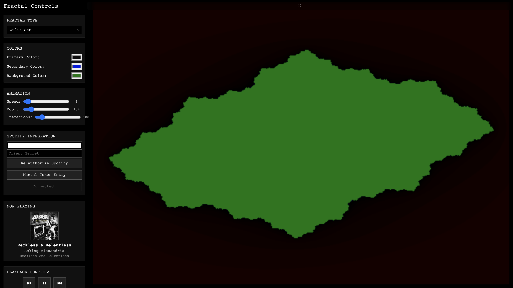

# Fractal Art Visualizer

A real-time fractal art generator with Spotify integration, built with HTML5 Canvas and JavaScript.

## Features

- **17 Fractal Types**: Mandelbrot, Julia Set, Burning Ship, Sierpinski Triangle, Tricorn, Multibrot, Phoenix, Newton, Biomorphs, Lyapunov, Magnet, Celtic, Heart, Spider, Fish Eye, Duck, Cosmic
- **Real-time Color Control**: Adjust primary, secondary, and background colors
- **Spotify Integration**: Music-enhanced visualizations with playback controls
- **Recording Capabilities**: 
  - Screenshot capture (PNG)
  - GIF recording
  - Video recording (WebM)
- **Interactive Controls**: 
  - Click to zoom/pan
  - Mouse wheel zoom
  - Animation speed control
  - Iteration count adjustment
- **Fullscreen Mode**: Immersive visualization experience

## Getting Started

### Prerequisites

- Node.js (v14 or higher)
- npm or yarn

### Installation

1. Clone the repository:
```bash
git clone <repository-url>
cd fractal-art-visualizer
```

2. Install dependencies:
```bash
npm install
```

3. Generate SSL certificates (required for Spotify integration):
```bash
npm run generate-certs
```

4. Start the HTTPS server:
```bash
npm run start:https
```

5. Open your browser and navigate to `https://localhost:3443`
   - **Important**: You'll see a security warning for the self-signed certificate
   - Click "Advanced" and then "Proceed to localhost (unsafe)"
   - This is normal for local development




### Alternative (HTTP only, no Spotify):
If you don't need Spotify integration, you can run the HTTP version:
```bash
npm start
```
Then visit `http://localhost:3000`

## Spotify Integration

### Step 1: Create a Spotify App

1. Go to the [Spotify Developer Dashboard](https://developer.spotify.com/dashboard)
2. Log in with your Spotify account
3. Click **"Create App"**
4. Fill out the form:
   - **App Name**: `Fractal Art Visualizer` (or any name you prefer)
   - **App Description**: `Interactive fractal visualizations with Spotify integration`
   - **Website**: `https://localhost:3443` (optional)
   - **Redirect URI**: `https://localhost:3443/callback` (**Important**: Must be exactly this)
   - **Which API/SDKs are you planning to use?**: Check "Web API"
5. Agree to the terms and click **"Save"**
6. Copy your **Client ID** and **Client Secret** from the app settings

### Step 2: Configure the Application

1. Make sure the HTTPS server is running (`npm run start:https`)
2. Open `https://localhost:3443` in your browser
3. In the **Spotify Integration** section:
   - Enter your **Client ID**
   - Enter your **Client Secret**
   - Click **"Authorize with Spotify"**
4. You'll be redirected to Spotify to log in and grant permissions
5. After authorization, you'll return to the app with full access!

### Step 3: Start Playing Music

1. Click **"Connect Spotify"** in the sidebar
2. Start playing music in Spotify (any device)
3. The visualization will now show:
   - Current track artwork and info
   - Working playback controls (play/pause/skip/volume)
   - Music-enhanced color effects

### Troubleshooting

**"Redirect URI mismatch" error:**
- Make sure your Spotify app's redirect URI is exactly: `https://localhost:3443/callback`
- Ensure you're using the HTTPS server, not HTTP

**"Invalid client" error:**
- Double-check your Client ID and Client Secret
- Make sure you're using the credentials from the correct Spotify app

**Controls not working:**
- Ensure you have an active Spotify session (Premium account recommended)
- Make sure Spotify is playing on some device

## Usage

### Fractal Controls

- **Fractal Type**: Choose from 17 different algorithms:
  - **Mathematical**: Mandelbrot, Julia Set, Tricorn, Multibrot
  - **Organic**: Biomorphs, Heart, Spider, Celtic
  - **Scientific**: Newton, Lyapunov, Magnet
  - **Artistic**: Phoenix, Fish Eye, Duck, Cosmic
  - **Geometric**: Sierpinski, Burning Ship
- **Colors**: Real-time color pickers for primary, secondary, and background
- **Animation Speed**: 0.5x to 10x speed (default: 3x)
- **Zoom**: 0.1x to 10x magnification
- **Iterations**: 50-500 iterations (higher = more detail, slower rendering)

### Media Controls (Spotify Connected)

- **Playback**: Play, pause, previous, next track
- **Progress**: Seek to any position in the current track
- **Volume**: Adjust Spotify playback volume
- **Now Playing**: See current track, artist, album, and artwork

### Mouse Interaction

- **Click**: Center the fractal on the clicked point
- **Mouse Wheel**: Zoom in/out
- **Fullscreen Button**: Corner button for immersive mode

### Recording & Export

- **Take Photo**: Capture current frame as PNG file
- **Record GIF**: Record 5-second animation as GIF
- **Record Video**: Record video in WebM format

### Keyboard Shortcuts

- **Spacebar**: Toggle play/pause animation
- **R**: Reset to default view
- **F**: Toggle fullscreen mode

## Technical Details

- Built with vanilla JavaScript (no frameworks)
- Uses HTML5 Canvas for rendering
- Web Audio API for music analysis
- MediaRecorder API for video capture
- GIF.js library for GIF generation

## License

MIT License - see LICENSE file for details